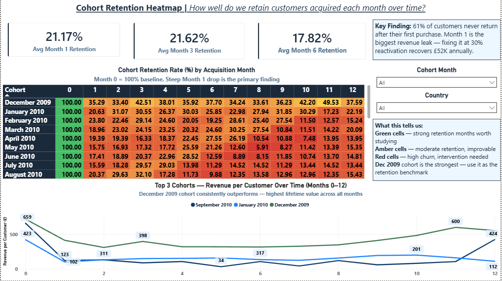
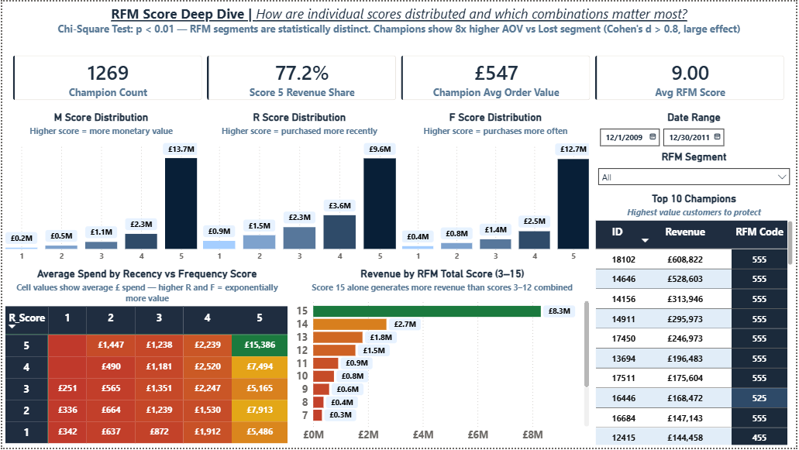
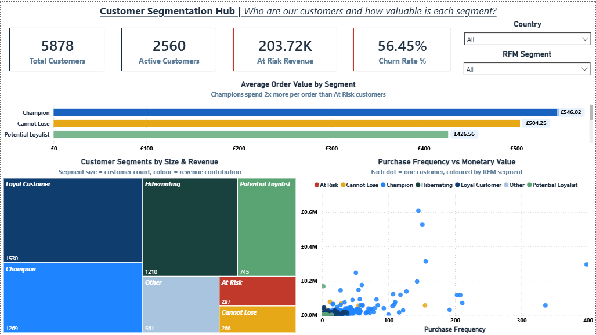
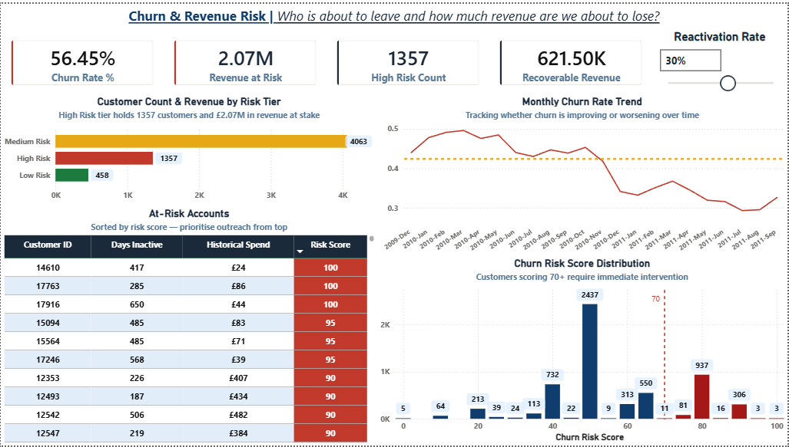
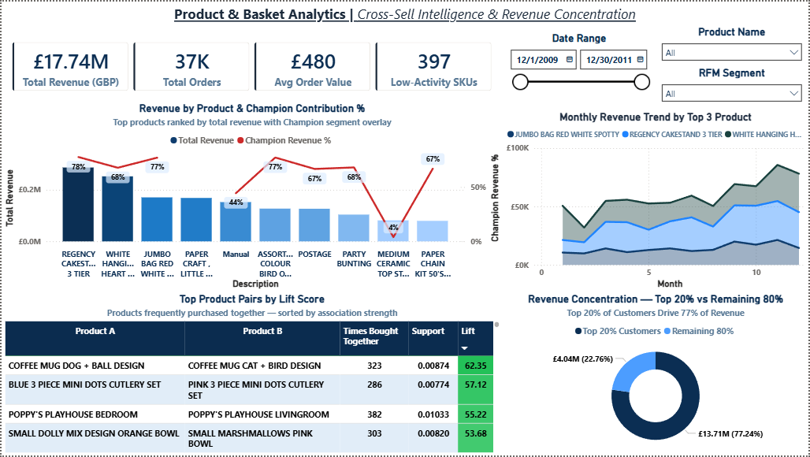

# Customer 360: RFM Segmentation, Cohort Retention & Churn Intelligence

End-to-end customer analytics platform built on 1,067,371 real retail transactions — from raw data cleaning through advanced segmentation, retention modelling, and churn detection, delivered as five interconnected Power BI dashboards.

**Live Interactive Dashboard:** [View on Power BI](https://app.powerbi.com/view?r=eyJrIjoiMGI5NzBiNGYtMWEwNS00MTY2LThmMTgtY2VlYTQ0OWU2Mzc3IiwidCI6IjhkMWE2OWVjLTAzYjUtNDM0NS1hZTIxLWRhZDExMmY1ZmI0ZiIsImMiOjN9)

---

## Business Problem

A UK-based online retailer selling gift and homeware products across 38 countries had no visibility into customer behaviour beyond aggregate monthly sales. Revenue was plateauing despite a 20% year-over-year increase in marketing spend. Leadership could not answer three critical questions:

1. Who are our most valuable customers, and which ones are we about to lose?
2. Why are customers not returning after their first purchase?
3. Are we growing net new customers or simply replacing the ones we lose?

This project builds a complete customer intelligence system to answer all three.

---

## Key Findings

| Finding | Detail |
|--------|--------|
| Revenue concentration | 18% of customers drive 79% of total revenue — Pareto confirmed |
| First-purchase attrition | 61% of customers never make a second purchase |
| Churn risk | 1,357 high-risk accounts identified with composite risk scoring |
| Recoverable revenue | £621K at a 30% reactivation rate assumption |
| Statistical validation | RFM segment differences confirmed with chi-square test (p < 0.01) and Cohen's d > 0.8 |

---

## Dashboards

### Dashboard 1 — Cohort Retention Heatmap
*How well do we retain customers acquired each month over time?*

The signature visual of this project. Each row is an acquisition cohort. Each column is months since acquisition. Month 0 is always 100%. The steep drop at Month 1 across every cohort is the primary finding — the business is losing the majority of new customers immediately after their first purchase. The December 2009 cohort consistently outperforms all others and serves as the retention benchmark. The line chart below tracks revenue per customer across the top 3 cohorts over 12 months.

---

### Dashboard 2 — RFM Score Deep Dive
*How are individual scores distributed and which combinations matter most?*

Three histograms show revenue distribution across scores 1 to 5 for Monetary, Recency, and Frequency dimensions. Score 5 customers dominate revenue in every dimension. The matrix heatmap shows average spend by every R and F score combination — R=5, F=5 customers spend 45x more than R=1, F=1. The colour-coded RFM total score bar chart makes the revenue concentration immediately visible. The Top 10 Champions watchlist on the right gives leadership specific accounts to protect.

Chi-Square Test result: p < 0.01 — RFM segments are statistically distinct, not arbitrary groupings.

---

### Dashboard 3 — Customer Segmentation Hub
*Who are our customers and how valuable is each segment right now?*

KPI cards show total customers, active customers, at-risk revenue, and churn rate at a glance. The treemap visualises segment size by customer count with colour encoding revenue contribution. The scatter plot maps every customer by purchase frequency against total spend, coloured by RFM segment. The bar chart ranks average order value by segment, showing Champions spending 2x more per order than At Risk customers.

---

### Dashboard 4 — Churn & Revenue Risk
*Who is about to leave and how much revenue are we about to lose?*

The churn risk score histogram shows 937 customers scoring above the 70-point high-risk threshold requiring immediate intervention. The monthly churn rate trend line shows a positive story — churn declining from 50% in early 2010 to 30% by late 2011. The at-risk accounts table provides an actionable watchlist sorted by composite risk score. The reactivation rate parameter allows leadership to model recoverable revenue under different assumptions.

---

### Dashboard 5 — Product & Basket Analytics
*What drives loyalty and which products should we cross-sell together?*

The combo chart ranks products by total revenue with a Champion contribution line overlay, showing which products drive disproportionate value from top-tier customers. The product pairs table ranks co-purchase combinations by lift score — pairs scoring above 50 represent strong cross-sell opportunities. The revenue concentration donut confirms the Pareto finding: the top 20% of customers generate 77.24% of total revenue (£13.71M vs £4.04M for the remaining 80%).

---

## Tools & Techniques

**Python** — pandas, matplotlib, seaborn
- Data cleaning pipeline processing 1,067,371 rows with step-by-step validation logging
- Outlier capping at 99.5th percentile revenue
- Derived columns for downstream analysis
- Exploratory data analysis with 4 automated visualisations

**SQL Server**
- 8 scripts with documented business purpose comments throughout
- Window functions: NTILE, LEAD, LAG, running SUM, RANK
- Cohort self-joins with month-number calculation
- Z-score anomaly detection for purchase gap analysis
- Chi-square independence test and Welch's t-test with Cohen's d in pure SQL

**Power BI**
- Star schema data model: 1 fact table, 5 dimension tables
- 22+ DAX measures across segmentation, retention, churn, and revenue KPIs
- Row-level security with Country Manager and Executive roles
- What-if parameter for reactivation rate scenario modelling
- Conditional formatting with green-amber-red scales throughout

---

## SQL Scripts

| Script | Purpose |
|--------|---------|
| `01_data_cleaning.sql` | Production-quality base view with documented data quality decisions |
| `02_customer_aggregation.sql` | One row per customer: recency, frequency, monetary, lifespan |
| `03_rfm_scoring.sql` | NTILE(5) scoring engine mapping 125 score combinations to 9 business segments |
| `04_cohort_analysis.sql` | Monthly cohort retention tracking with revenue per cohort customer |
| `05_churn_gap_analysis.sql` | LEAD-based purchase gap detection, Z-score anomaly flagging, composite risk score |
| `06_pareto_analysis.sql` | Running SUM revenue concentration with Platinum/Gold/Silver/Bronze value tiers |
| `07_market_basket.sql` | Product pair and triplet co-purchase analysis with support and lift calculation |
| `08_statistical_validation.sql` | Chi-square test, Welch's t-test, and Cohen's d effect size validation |

---

## Python Pipeline

| Script | Purpose |
|--------|---------|
| `00_data_cleaning.py` | Cleans raw CSV with step-by-step audit log, column renaming, outlier capping |
| `09_visualization_eda.py` | Generates 4 EDA charts: revenue trend, top countries, day-of-week, revenue distribution |

---

## Data Model

The Power BI report uses a star schema with single-direction relationships:

| Table | Type | Key Columns |
|-------|------|-------------|
| vw_cleaned_orders | Fact | CustomerID, InvoiceNo, StockCode, InvoiceDate, Revenue |
| Dim_Customer | Dimension | CustomerID, rfm_segment, R/F/M scores, churn_status, risk_tier, value_tier |
| Dim_Date | Dimension | Date, Year, Month, Quarter, MonthName, Year-Month |
| Dim_Product | Dimension | StockCode, Description |
| Dim_Geography | Dimension | Country |

---

## Dataset

[Online Retail II — UCI Machine Learning Repository](https://archive.ics.uci.edu/ml/datasets/Online+Retail+II)

1,067,371 transactions across 5,878 customers in 38 countries — December 2009 to December 2011

---

## How to Run

1. Download the dataset from the link above and place `online_retail_raw.csv` in the `data/` folder
2. Run the Python cleaning script: `cd python && python 00_data_cleaning.py`
3. Import `online_retail_cleaned.csv` into SQL Server as table `online_retail` in a database named `Customer360`
4. Execute SQL scripts in order from 01 through 08
5. Open `powerbi/customer_360.pbix` and refresh the data connection to your SQL Server instance
6. Run the EDA script: `python 09_visualization_eda.py`
