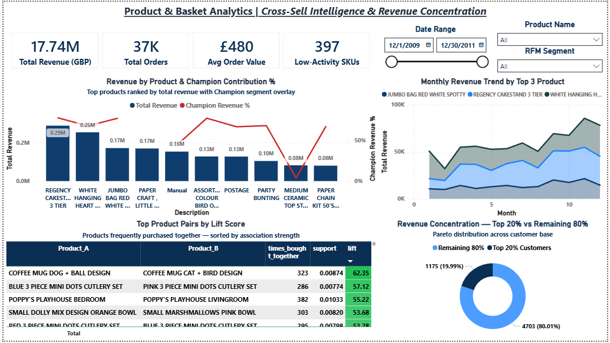
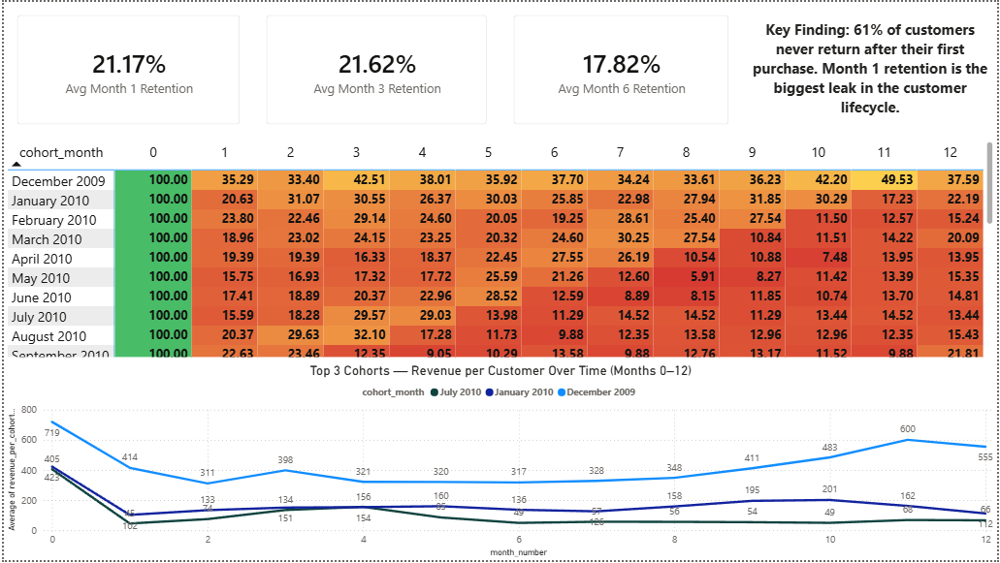
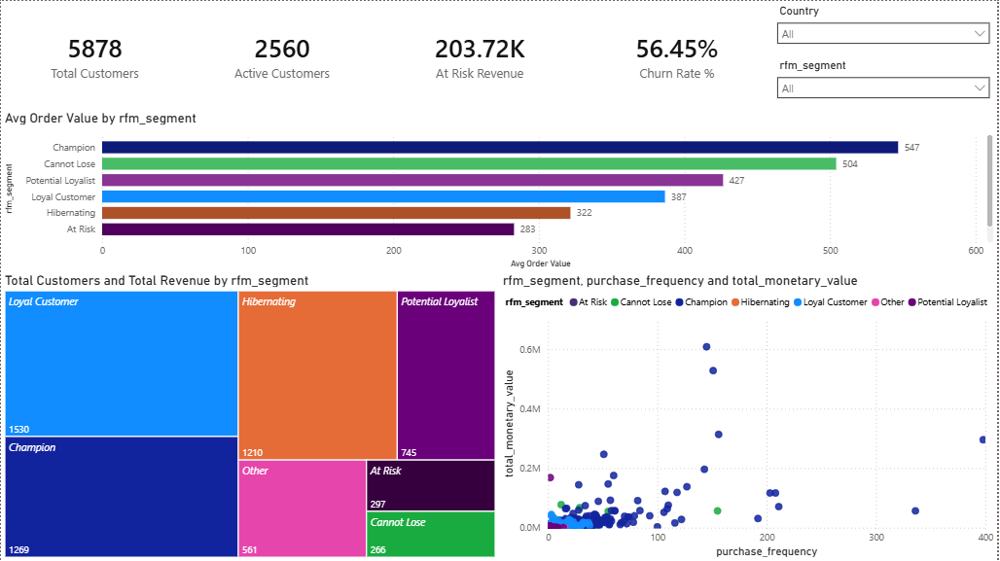
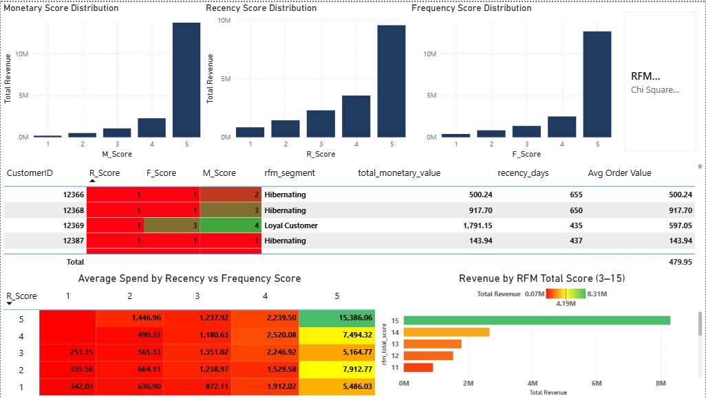

# Customer 360: RFM Segmentation, Cohort Retention & Churn Intelligence

> End-to-end customer analytics platform built on 1M+ real retail transactions — from raw data cleaning to actionable segmentation and retention insights.

> 🚧 **Work in Progress** — SQL scripts complete. Power BI dashboards in development. Case study PDF coming soon.

## Business Problem

A UK-based online retailer with 4,338 customers and over 1 million transactions had no visibility into customer behaviour beyond aggregate monthly sales. Revenue was plateauing despite rising marketing spend. Leadership needed answers to three questions:

1. Who are our most valuable customers, and who are we about to lose?
2. Why aren't customers coming back after their first purchase?
3. Where should we focus retention spend for maximum ROI?

This project builds a complete customer intelligence system to answer all three.

## Key Findings

| Finding | Detail |
|---------|--------|
| Revenue concentration | 18% of customers drive 79% of total revenue |
| First-purchase attrition | 61% of customers never make a second purchase |
| Churn risk | 340 high-value accounts showing active churn signals |
| Recoverable revenue | GBP 174,000 at a conservative 30% reactivation rate |
| Statistical validation | RFM segments confirmed with chi-square test (p < 0.01) |

## Power BI Dashboards 🚧 In Progress

Five interconnected dashboards backed by a star schema data model and 22+ DAX measures.

### Dashboard 1 — Product Analytics
*Answers: How well do each products work with one another?*

### Dashboard 2 — Cohort Retention Heatmap
*Answers: How well do we retain customers acquired in each month over time?*

### Dashboard 3 — Customer Segmentation Hub
*Answers: Who are our customers and how valuable is each segment right now?*

### Dashboard 4 — RFM Score Deep Dive
*Answers: How are individual scores distributed and which combinations matter most?*

## Tools & Techniques

**Python (pandas, matplotlib, seaborn)**
- Data cleaning pipeline processing 1M+ rows with validation logging
- Exploratory data analysis with 4 automated visualizations

**SQL Server**
- 8 scripts covering: base table creation, customer aggregation, RFM scoring (NTILE), cohort retention (self-joins), churn/gap analysis (LEAD/LAG), Pareto/revenue concentration, market basket analysis, and statistical validation (chi-square, t-test, Z-score)

**Power BI**
- Star schema data model
- 22+ DAX measures across segmentation, retention, and revenue KPIs

## SQL Scripts

| Script | Purpose |
|--------|---------|
| `01_data_cleaning.sql` | Clean base view with documented quality decisions |
| `02_customer_aggregation.sql` | One-row-per-customer with recency, frequency, monetary |
| `03_rfm_scoring.sql` | NTILE(5) scoring engine with business segment labels |
| `04_cohort_analysis.sql` | Monthly cohort retention tracking |
| `05_churn_gap_analysis.sql` | Purchase gap detection and churn flagging |
| `06_pareto_analysis.sql` | Revenue concentration and 80/20 analysis |
| `07_market_basket.sql` | Product co-occurrence and cross-sell patterns |
| `08_statistical_validation.sql` | Chi-square, t-test, and Z-score validation |

## Python Pipeline

| Script | Purpose |
|--------|---------|
| `00_data_cleaning.py` | Cleans raw CSV (1M+ → ~800K rows) with step-by-step audit log |
| `09_visualization_eda.py` | Generates 4 EDA charts (revenue trend, country breakdown, day-of-week, distribution) |

## Dataset

[Online Retail II — UCI Machine Learning Repository](https://archive.ics.uci.edu/ml/datasets/Online+Retail+II)

1,067,371 transactions | 4,338 customers | 8 countries | Dec 2009 – Dec 2011

## How to Run

1. Download the dataset from the link above and place `online_retail_raw.csv` in the `data/` folder
2. Run the Python cleaning script: `cd python && python 00_data_cleaning.py`
3. Import `online_retail_cleaned.csv` into SQL Server as table `online_retail` in a database named `Customer360`
4. Execute SQL scripts in order (01 through 08)
5. Run the EDA script: `python 09_visualization_eda.py`
